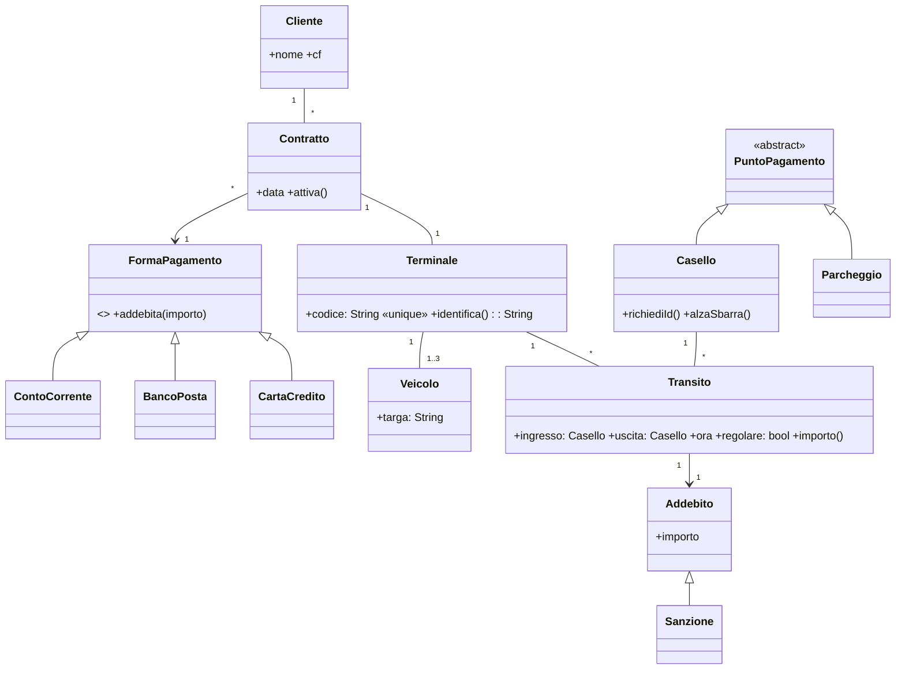
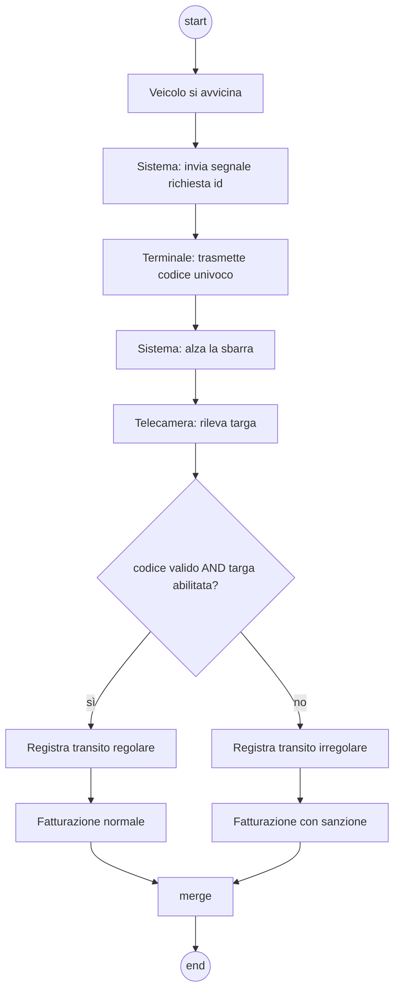

## Contesto
Svolgere gli esercizi mediante diagrammi UML ben commentati. Libri chiusi.

## [aperta 4] Definire gli attori e i casi d'uso per il servizio Telepass. Il sistema prevede l'utilizzo di un terminale collocato sul parabrezza di veicoli, e consente di pagare il pedaggio senza fermarsi alle barriere; in certi luoghi il Telepass può essere usato per pagare un parcheggio. Il terminale Telepass è assegnato ad un cliente tramite un contratto che definisce la forma di pagamento, che consiste in un addebito periodico su conto corrente, BancoPosta o carta di credito. Il terminale è identificato da codice univoco, e può essere utilizzato da un massimo di tre veicoli le cui targhe devono essere comunicate ad Autostrade per l'Italia. Il transito dei veicoli viene tracciato all'ingresso e all'uscita, e produce un addebito corrispondente sul conto del cliente, o una sanzione in caso di transito irregolare.

### Soluzione
Attori: **Cliente**, **Terminale Telepass** (dispositivo), **Casello/Barriera** e **Parcheggio** (sistemi esterni), **Banca/Ente pagamento**, **Operatore Autostrade**.

Use case:
- *Stipulare contratto* (Cliente, Operatore) — `<<include>>` *Scegliere forma di pagamento*
- *Registrare targhe* (Cliente; max 3)
- *Transitare in ingresso* / *Transitare in uscita* (Terminale, Casello) — `<<include>>` *Identificare terminale*
- *Pagare parcheggio* (Terminale, Parcheggio)
- *Addebitare pedaggio* (Banca) — `<<extend>>` *Applicare sanzione* [transito irregolare]
- *Emettere addebito periodico* (Banca, timer)

### Griglia
- 1 | Attori umani e sistemi esterni individuati
- 2 | Use case principali (contratto, targhe, transito, parcheggio, addebito)
- 1 | include/extend usati correttamente (es. sanzione come extend)

## [aperta 4] Disegnare le schede CRC per l'esercizio precedente.

### Soluzione
| Classe | Responsabilità | Collaboratori |
|---|---|---|
| Cliente | dati anagrafici, stipulare contratti | Contratto |
| Contratto | associare terminale e cliente, forma di pagamento | Cliente, Terminale, FormaPagamento |
| FormaPagamento (CC, BancoPosta, Carta) | eseguire addebito periodico | Contratto, Conto |
| Terminale | codice univoco, rispondere a richiesta di identificazione, max 3 targhe | Veicolo, Contratto |
| Veicolo | targa | Terminale |
| Transito | registrare ingresso/uscita, calcolare importo, regolare/irregolare | Terminale, Casello, Addebito |
| Casello | richiedere identificazione, alzare sbarra, rilevare targa | Transito, Telecamera |
| Addebito / Sanzione | importo da imputare sul conto | Transito, FormaPagamento |

### Griglia
- 2 | Classi chiave con responsabilità
- 1 | Collaboratori coerenti
- 1 | Vincoli espressi (3 targhe, codice univoco)

## [aperta 4] Disegnare e commentare un diagramma delle classi coerente con le schede CRC.

### Soluzione

Commenti: molteplicità 1..3 per i veicoli; FormaPagamento astratta permette nuovi metodi di pagamento; Sanzione specializza Addebito.

### Griglia
- 2 | Classi e gerarchia pagamenti corrette
- 1 | Molteplicità (1..3 veicoli, 1 terminale per contratto)
- 1 | Commenti e coerenza con CRC

## [aperta 6] Arricchire il diagramma dell'esercizio 3 con uno o più design pattern (3 punti per design pattern, massimo 2).

### Soluzione
- **Strategy** per `FormaPagamento`: il Contratto usa un'interfaccia `StrategiaPagamento` intercambiabile (CC, BancoPosta, Carta) — si aggiungono metodi senza toccare Contratto.
- **Observer**: `Casello` (subject) notifica gli osservatori `Fatturazione` e `Statistiche` a ogni transito registrato.
- Alternative: **State** per il Transito (in corso / regolare / irregolare); **Factory Method** per creare Addebito vs Sanzione; **Singleton** per il registro centrale dei terminali.

### Griglia
- 3 | Primo pattern: pertinente, ruoli corretti, integrato nel diagramma
- 3 | Secondo pattern: pertinente, ruoli corretti, integrato nel diagramma

## [aperta 5] Disegnare un diagramma di attività che descriva il transito di un veicolo da un cancello di ingresso abilitato al Telepass. Quando un veicolo si avvicina ad un cancello, il sistema emette un segnale di richiesta di identificazione. Il terminale risponde al segnale ritrasmettendo un codice identificativo univoco. Allora il sistema alza la sbarra e una telecamera rileva la targa del veicolo che attraversa il cancello. Nel caso il codice ricevuto sia corretto e corrisponda ad una delle targhe abilitate, il sistema registra il transito regolare (cui segue fatturazione "normale"), altrimenti viene registrato un transito irregolare cui segue fatturazione con sanzione.

### Soluzione
Swimlane: **Sistema casello | Terminale | Telecamera**.

Elementi: segnali send/receive per richiesta/risposta, decisione con guardie complementari, merge.

### Griglia
- 1 | Sequenza: segnale, risposta, sbarra, telecamera
- 1 | Decisione con guardie corrette (codice + targa)
- 1 | Due rami di fatturazione e merge
- 2 | Swimlane / segnali UML e commenti

## [aperta 4] Data l'Epica "Uso di telepass da parte di un imprenditore", scomporla in 4 user stories stimate.

### Soluzione
1. Come imprenditore voglio associare fino a 3 veicoli aziendali al terminale così da usarlo per tutta la flotta. *(3 pt)*
2. Come imprenditore voglio ricevere fattura intestata all'azienda così da scaricare i costi. *(5 pt)*
3. Come imprenditore voglio consultare online lo storico dei transiti per veicolo così da controllare le spese. *(5 pt)*
4. Come imprenditore voglio pagare il parcheggio dell'aeroporto con il Telepass così da non perdere tempo. *(2 pt)*

### Griglia
- 2 | 4 storie formato corretto, legate all'epica
- 1 | Stime relative
- 1 | Storie atomiche/indipendenti (INVEST)
