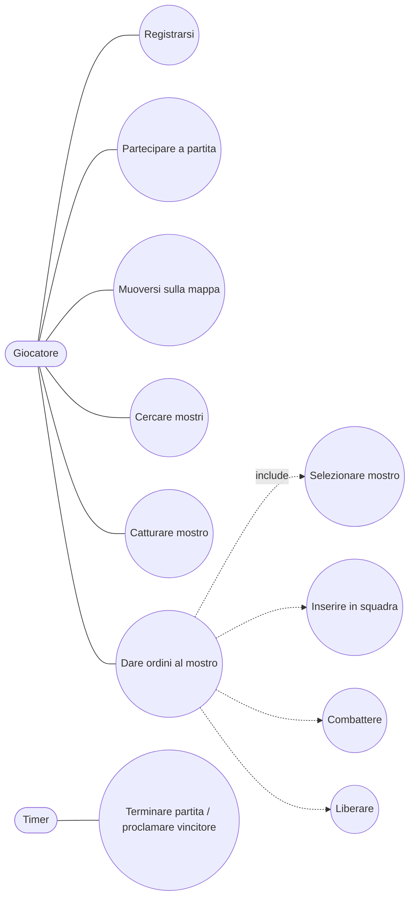
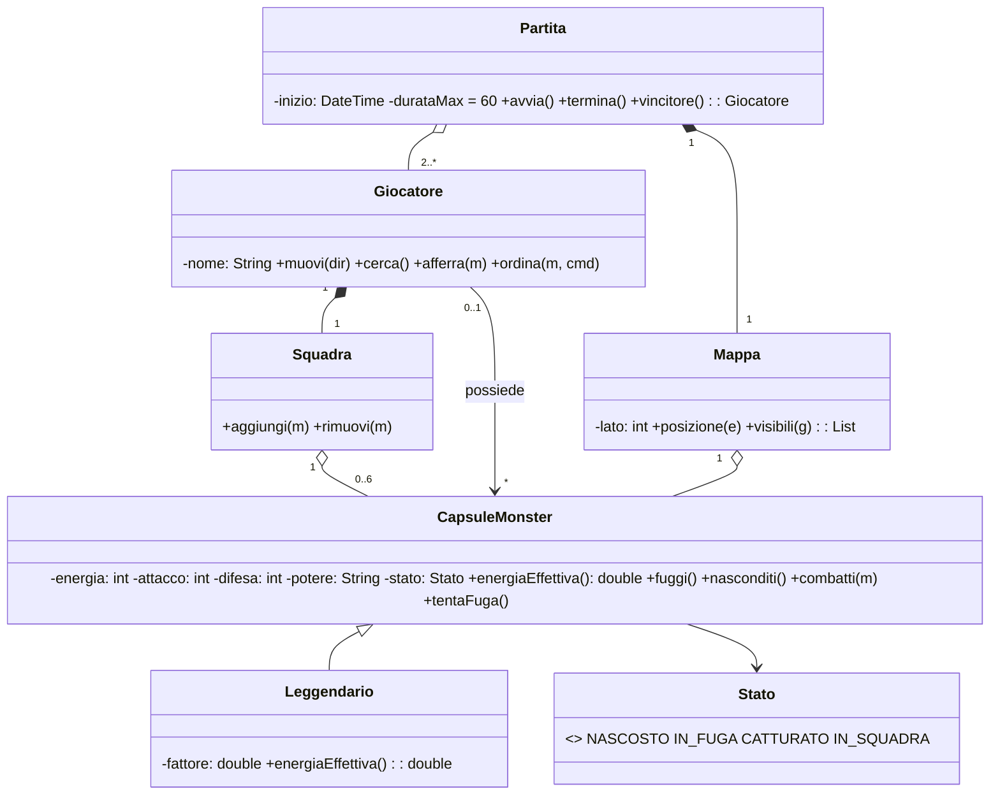
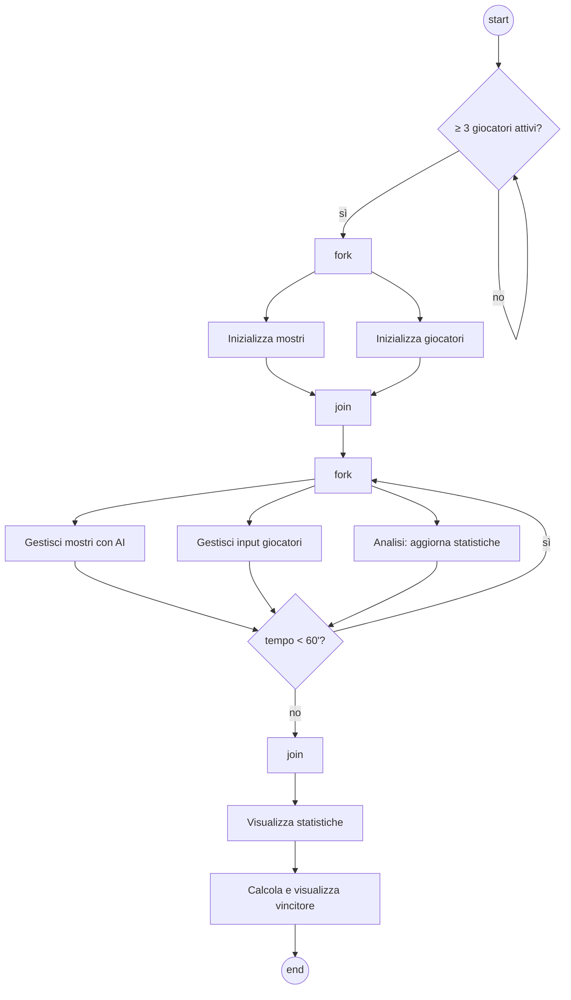

## Contesto
Si vuole progettare il gioco **"CapsuleMonster"**, descritto nel seguito.

Ogni partita è composta da almeno due giocatori, e si gioca su una mappa quadrata. Ogni giocatore è caratterizzato dal nome – che deve essere registrato nel sistema – ed è l'allenatore di una squadra di CapsuleMonster (massimo 6 mostri).

La partita inizia quando ci sono almeno 3 giocatori attivi, e dura un massimo di 60 minuti. Il possessore del CapsuleMonster con più energia al termine del gioco è dichiarato vincitore. Ogni giocatore inizia senza mostri, e inizia a girare per la mappa in cerca di CapsuleMonster. Il giocatore, a ogni dato istante, può muoversi, cercare, tentare di catturare il mostro, dare ordini al CapsuleMonster.

Un CapsuleMonster è inizialmente nascosto e non appartiene a nessun giocatore. Se è visto da un giocatore si mette in fuga. Se quando è in fuga viene "afferrato" dal giocatore allora, se ha un livello di energia inferiore a 5 viene catturato e diventa proprietà del giocatore. Altrimenti si nasconde di nuovo ma con un livello di energia diminuito di 1. Nello stato catturato il giocatore può: (i) dirgli di entrare in squadra; (ii) ordinargli di combattere con un CapsuleMonster avversario; (iii) liberarlo.

Ogni CapsuleMonster è caratterizzato da un livello energia, valori di attacco, difesa e un potere speciale unico. Alcuni CapsuleMonster sono Leggendari ed hanno un fattore moltiplicativo della propria energia (un reale compreso tra 1 e 2). Se è libero, si muove ad intervalli casuali. Se è prigioniero, esegue gli ordini del giocatore, e tenta di scappare ad intervalli casuali.

## [aperta 4] Scrivere il diagramma dei casi d'uso del sistema appena descritto.

### Soluzione
Attori: **Giocatore** (primario), **Timer/Sistema di gioco** (attore temporale, scadenza 60'), eventualmente **CapsuleMonster (AI)**.

O1–O3 come `<<extend>>` o specializzazioni di *Dare ordini*. Possibile `<<include>>` *Autenticarsi* in *Partecipare a partita*.

### Griglia
- 1 | Attori corretti (Giocatore + timer/sistema)
- 2 | Use case principali: registrazione, partita, muoversi/cercare/catturare, ordini
- 1 | Uso corretto di include/extend e confine del sistema

## [aperta 4] Disegnare le schede CRC per l'esercizio precedente.

### Soluzione
| Classe | Responsabilità | Collaboratori |
|---|---|---|
| **Partita** | avviare con ≥3 giocatori, gestire tempo max 60', determinare vincitore | Giocatore, Mappa, Timer |
| **Giocatore** | nome registrato, muoversi, cercare, afferrare, dare ordini | Squadra, Mappa, CapsuleMonster |
| **Squadra** | contenere max 6 mostri, aggiungere/rimuovere | CapsuleMonster |
| **Mappa** | griglia quadrata, posizioni di giocatori e mostri, visibilità | Giocatore, CapsuleMonster |
| **CapsuleMonster** | energia, attacco, difesa, potere; stati nascosto/in fuga/catturato; muoversi, scappare, combattere | Giocatore, Mappa |
| **Leggendario** | applicare fattore moltiplicativo [1,2] all'energia | CapsuleMonster |
| **Combattimento** | risolvere scontro tra due mostri | CapsuleMonster |

### Griglia
- 2 | Classi principali con responsabilità corrette
- 1 | Collaboratori coerenti
- 1 | Vincoli del testo assegnati (max 6, ≥3 giocatori, 60', energia<5)

## [aperta 5] Disegnare e commentare un diagramma delle classi coerente con le schede CRC.

### Soluzione

Commenti: `Leggendario` fa override di `energiaEffettiva()` (= energia × fattore, vincolo `{1 ≤ fattore ≤ 2}`); il vincitore si calcola su `energiaEffettiva` dei mostri posseduti; vincolo `{giocatori ≥ 3 per avviare}` su Partita.

### Griglia
- 2 | Classi e attributi corretti (energia, attacco, difesa, potere, fattore)
- 1 | Generalizzazione Leggendario con override
- 1 | Associazioni e molteplicità (0..6 mostri, ≥2/3 giocatori)
- 1 | Commenti/vincoli e coerenza con le CRC

## [aperta 3] (Opzionale) Mostrare e commentare nel diagramma un design pattern GoF.

### Soluzione
Scelte naturali:
- **State**: il comportamento del CapsuleMonster dipende dallo stato (Nascosto, InFuga, Catturato). Interfaccia `StatoMostro` con `afferrato(m)`, `visto(m)`, `tick(m)`; classi concrete per ogni stato; `CapsuleMonster` delega allo stato corrente. Elimina gli `if/switch` sullo stato.
- **Command**: gli ordini del giocatore (`EntraInSquadra`, `Combatti`, `Libera`) come oggetti `Comando.esegui()`.
- **Observer**: la Partita osserva il Timer; l'Analisi osserva gli eventi per le statistiche.
- **Singleton** per la Partita / Mappa.

### Griglia
- 1 | Pattern pertinente al problema
- 1 | Struttura corretta del pattern (ruoli)
- 1 | Commento su perché migliora il design

## [aperta 5] Scrivere un diagramma di attività che gestisce l'intera partita. Essa è formata da sottoattività: partita e analisi. La partita inizializza i mostri e i giocatori, quindi gestisce i mostri (tramite AI) e l'input dei giocatori. L'analisi gestisce e visualizza le statistiche di gioco. Al termine del tempo visualizza le statistiche e il vincitore.

### Soluzione

Elementi chiave: fork/join per le attività concorrenti (AI, input, analisi), **evento temporale** (clessidra 60') che interrompe la partita (interruptible region), sottoattività con simbolo rastrello.

### Griglia
- 1 | Inizializzazione mostri/giocatori
- 2 | Concorrenza AI / input / analisi con fork-join
- 1 | Terminazione per tempo (evento temporale o guardia)
- 1 | Statistiche e vincitore alla fine

## [aperta 5] Scrivere 4 user stories, complete di stima relativa e almeno una condizione di verifica per ognuna relativa al problema in esame. Utilizzare almeno due attori diversi.

### Soluzione
1. **Come giocatore** voglio registrarmi con un nome così da poter partecipare alle partite. *Stima*: 2. *Verifica*: un nome già esistente viene rifiutato.
2. **Come giocatore** voglio afferrare un mostro in fuga così da catturarlo. *Stima*: 5. *Verifica*: se energia < 5 il mostro diventa mio; altrimenti si nasconde con energia − 1.
3. **Come giocatore** voglio inserire un mostro catturato nella mia squadra così da usarlo in combattimento. *Stima*: 3. *Verifica*: con 6 mostri in squadra l'inserimento è rifiutato.
4. **Come amministratore/sistema di gioco** voglio terminare la partita dopo 60 minuti così da proclamare il vincitore. *Stima*: 3. *Verifica*: a 60' vince il proprietario del mostro con energia effettiva massima (fattore leggendario applicato).

Stime in story point relativi (es. Fibonacci 1,2,3,5,8).

### Griglia
- 2 | 4 storie nel formato ruolo/obiettivo/beneficio, con almeno 2 attori
- 1 | Stima relativa per ciascuna
- 2 | Condizioni di verifica concrete e testabili
