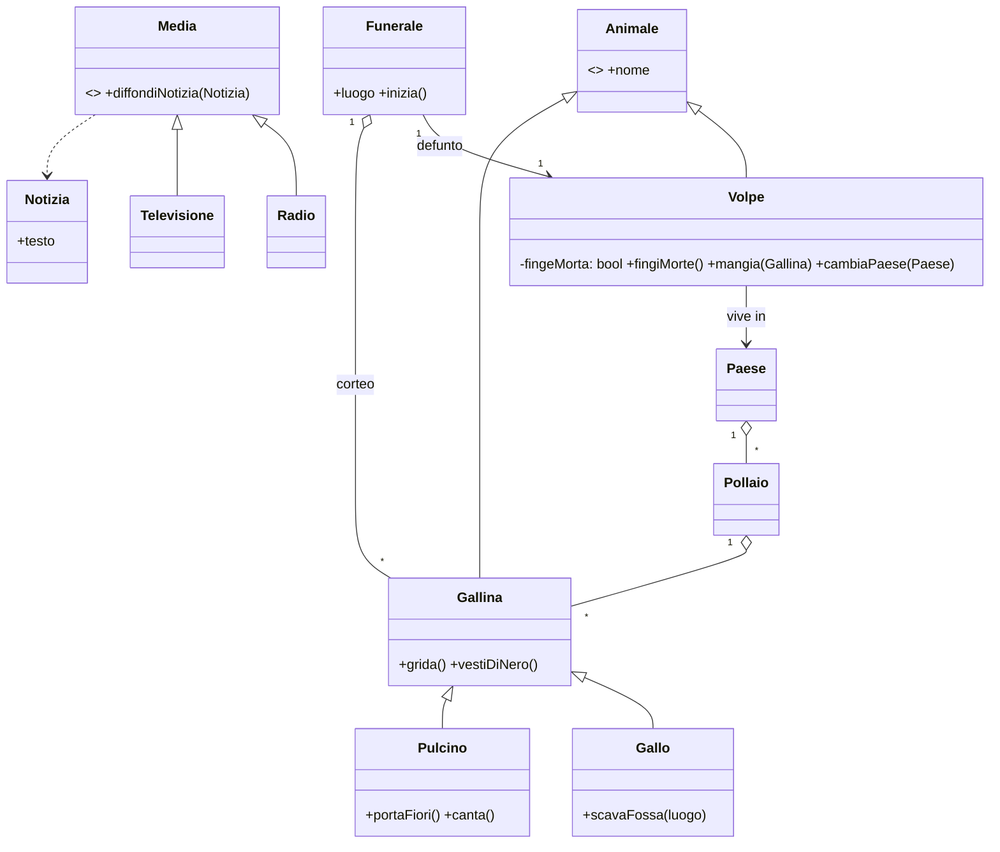
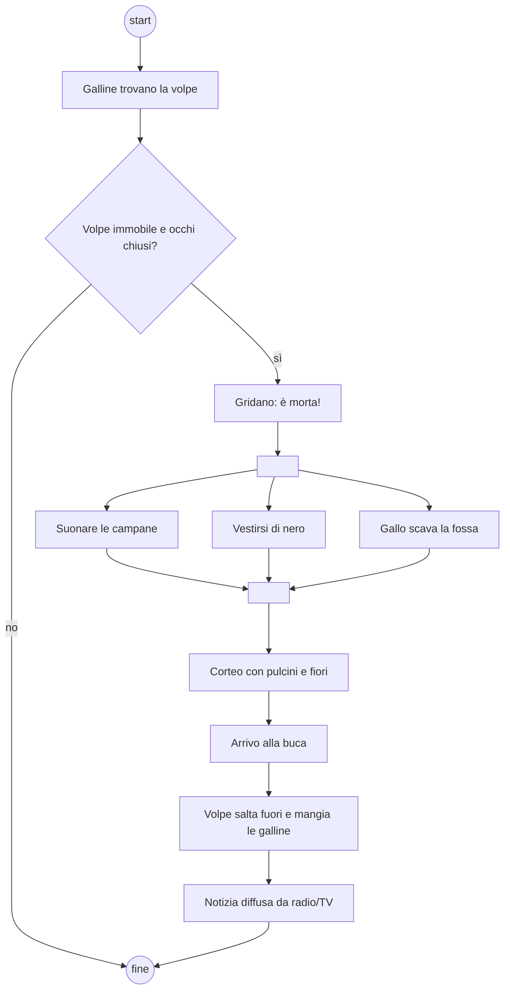

## [mcq 3] Quale delle seguenti affermazioni descrive meglio il compito principale del project manager di un prodotto software?
- [ ] Assicurarsi che ogni sviluppatore scriva il codice meno costoso possibile nel minor tempo possibile.
- [ ] Gestire i requisiti parlando con gli stakeholder e analizzandoli col team di sviluppo.
- [ ] Gestire il testing in modo automatico cercando di risparmiare tempo e diminuire effort.
- [x] Assicurarsi che il prodotto sia completato nei tempi previsti, rimanendo entro il budget e soddisfacendo i requisiti richiesti.

### Soluzione
Il PM governa il "triangolo" tempi–costi–ambito (qualità/requisiti). La gestione dei requisiti con gli stakeholder (b) è compito del product owner / analista.

## [mcq 3] Qual è la principale differenza tra requisiti funzionali e requisiti non funzionali nel contesto dello sviluppo software?
- [ ] I requisiti funzionali descrivono come il software deve essere implementato, mentre i requisiti non funzionali descrivono cosa il software deve fare.
- [ ] I requisiti funzionali sono sempre obbligatori, mentre i requisiti non funzionali sono opzionali.
- [x] I requisiti funzionali definiscono i comportamenti e le operazioni del sistema, mentre i requisiti non funzionali specificano vincoli o caratteristiche di qualità del sistema.
- [ ] I requisiti funzionali riguardano solo l'interfaccia utente, mentre i requisiti non funzionali riguardano solo il backend del sistema.

### Soluzione
Funzionali = *cosa* fa il sistema (servizi, comportamento). Non funzionali = *come bene* lo fa: prestazioni, sicurezza, usabilità, affidabilità, vincoli.

## [mcq 3] Quale delle seguenti caratteristiche identifica meglio un processo di sviluppo agile?
- [x] La suddivisione del lavoro in iterazioni brevi e incrementali con feedback frequenti dagli stakeholder.
- [ ] L'uso delle user story per definire completamente i requisiti di prodotto prima di iniziare lo sviluppo.
- [ ] La pianificazione accurata di tutte le attività necessarie al prodotto prima dell'avvio dello sviluppo.
- [ ] L'individuazione di un singolo responsabile che prenda tutte le decisioni tecniche e di progetto.

### Soluzione
Agile = iterativo e incrementale (sprint), feedback continuo. (b) e (c) descrivono un approccio a cascata (big design up front).

## [mcq 3] Il late binding permette
- [ ] la definizione di modelli generici
- [ ] la definizione di più funzioni con nomi identici ma parametri diversi risolta durante la compilazione
- [ ] la definizione di più funzioni con nomi identici ma parametri diversi risolta durante l'esecuzione
- [x] l'associazione del corpo di una funzione al suo nome durante l'esecuzione

### Soluzione
Late (dynamic) binding: quale implementazione eseguire si decide a runtime in base al tipo dinamico dell'oggetto (es. metodi `virtual` in C++). (a) = template/generics, (b) = overloading (risolto staticamente). Attenzione: sulla scansione lo studente ha crociato (c), che è sbagliata.

## [mcq 3] L'overloading in Python
- [ ] dà un errore di compilazione
- [ ] è strutturato come in C++
- [ ] richiede una fase di preprocessamento
- [x] è gestito tramite un decorator

### Soluzione
Python non ha overloading nativo: definire due volte la stessa funzione sovrascrive la prima (nessun errore). Si simula con decorator come `functools.singledispatch` / `singledispatchmethod` (o `typing.overload` per i soli type hint).

## Contesto
Si consideri la seguente storiella di Gianni Rodari:

> "Una volta le galline trovarono la volpe in mezzo al sentiero. Aveva gli occhi chiusi, la coda non si muoveva. - È morta, è morta - gridarono le galline. - Facciamole il funerale. Difatti suonarono le campane a morto, si vestirono di nero e il gallo andò a scavare la fossa in fondo al prato. Fu un bellissimo funerale e i pulcini portavano i fiori. Quando arrivarono vicino alla buca la volpe saltò fuori dalla cassa e mangiò tutte le galline.
> La notizia volò di pollaio in pollaio. Ne parlò perfino la radio, ma la volpe non se ne preoccupò. Lasciò passare un po' di tempo, cambiò paese, si sdraiò in mezzo al sentiero e chiuse gli occhi. Vennero le galline di quel paese e subito gridarono anche loro: - È morta, è morta! Facciamole il funerale.
> Suonarono le campane, si vestirono di nero e il gallo andò a scavare la fossa in mezzo al granoturco. Fu un bellissimo funerale e i pulcini cantavano che si sentivano in Francia. Quando furono vicini alla buca, la volpe saltò fuori dalla cassa e mangiò tutto il corteo.
> La notizia volò di pollaio in pollaio e fece versare molte lacrime. Ne parlò anche la televisione, ma la volpe non si prese paura per nulla. Essa sapeva che le galline hanno poca memoria e campò tutta la vita facendo la morta. E chi farà come quelle galline vuol dire che non ha capito la storia.."

## [aperta 3] Si generi il diagramma a classi della storia nel suo complesso estraendo oggetti.

### Soluzione

Punti chiave: gerarchia Animale (Gallo e Pulcino come specializzazioni/ruoli del pollame), Funerale come classe-evento che associa la volpe (finta defunta) e il corteo, Media con Radio/Televisione come specializzazioni, Paese/Pollaio come aggregazioni.

### Griglia
- 1 | Classi principali corrette (Volpe, Gallina/Gallo/Pulcino, Funerale, Paese o Pollaio, Radio/TV)
- 1 | Uso sensato di generalizzazione (es. Animale, Media)
- 1 | Associazioni/aggregazioni con molteplicità coerenti con la storia

## [aperta 3] Si estraggano i metodi.

### Soluzione
- **Volpe**: `fingiMorte()`, `saltaFuori()`, `mangia(galline)`, `cambiaPaese(p)`
- **Gallina**: `grida(msg)`, `vestiDiNero()`, `organizzaFunerale(volpe)`, `piangi()`, `dimentica()` (poca memoria)
- **Gallo**: `scavaFossa(luogo)`
- **Pulcino**: `portaFiori()`, `canta()`
- **Campana**: `suonaAMorto()`
- **Funerale**: `inizia()`, `raggiungiBuca()`
- **Radio / Televisione** (Media): `diffondi(notizia)`

Ogni metodo deriva da un verbo della storia, attribuito alla classe che compie l'azione.

### Griglia
- 1 | Metodi derivati dai verbi della storia
- 1 | Metodi assegnati alla classe giusta (chi compie l'azione)
- 1 | Firme sensate (parametri dove servono, es. mangia(Gallina))

## [aperta 3] Si determinino almeno due storie atomiche estratte dalla descrizione.

### Soluzione
User story nel formato *Come <ruolo> voglio <obiettivo> così da <beneficio>*, con criterio di accettazione:

1. **Come** volpe **voglio** fingermi morta in mezzo al sentiero **così da** attirare le galline.
   *Accettazione*: quando una gallina vede la volpe immobile con occhi chiusi, la classifica come "morta".
2. **Come** gallina **voglio** organizzare un funerale per l'animale morto **così da** onorarlo.
   *Accettazione*: il funerale prevede campane, vestiti neri e fossa scavata dal gallo.
3. **Come** media (radio/TV) **voglio** diffondere la notizia **così da** informare gli altri pollai.

Atomica = una sola funzionalità, che dà valore a un attore, stimabile e verificabile.

### Griglia
- 1 | Almeno due storie nel formato ruolo / obiettivo / beneficio
- 1 | Storie atomiche (una sola funzionalità ciascuna)
- 1 | Criterio di verifica/accettazione o stima presenti

## [aperta 3] Si presenti un diagramma di attività desumibile da una parte qualunque della descrizione.

### Soluzione
Il funerale (prima parte):

Elementi attesi: nodo iniziale/finale, decisione con guardie, **fork/join** per le azioni parallele (campane, vestiti, fossa), eventualmente swimlane Galline / Gallo / Volpe.

### Griglia
- 1 | Nodi iniziale/finale e azioni corrette in sequenza
- 1 | Uso di decisione con guardie e/o fork-join per il parallelismo
- 1 | Coerenza con la storia (eventuali swimlane)

## [aperta 3] Si descriva il design pattern del singleton e si evidenzi la sua struttura specifica in Python.

### Soluzione
**Singleton** (GoF, creazionale): garantisce che una classe abbia **una sola istanza** e fornisce un **punto di accesso globale** ad essa. Struttura: costruttore non accessibile dall'esterno, attributo statico con l'istanza, metodo statico `getInstance()` che la crea alla prima chiamata (lazy).

In Python non esistono costruttori privati: si interviene su `__new__` (o con una metaclasse / decorator, o semplicemente col modulo, che è già un singleton).

```python
class Singleton:
    _instance = None

    def __new__(cls, *args, **kwargs):
        if cls._instance is None:
            cls._instance = super().__new__(cls)
        return cls._instance

a = Singleton(); b = Singleton()
assert a is b
```
Variante con metaclasse:
```python
class SingletonMeta(type):
    _instances = {}
    def __call__(cls, *a, **k):
        if cls not in cls._instances:
            cls._instances[cls] = super().__call__(*a, **k)
        return cls._instances[cls]

class Config(metaclass=SingletonMeta): pass
```
Attenzione: `__init__` viene richiamato a ogni `Singleton()` anche se l'istanza è la stessa; la metaclasse evita il problema. Thread-safety: proteggere la creazione con un `threading.Lock`.

### Griglia
- 1 | Intento: istanza unica + accesso globale
- 1 | Struttura (istanza statica, accesso controllato, creazione lazy)
- 1 | Implementazione Python corretta (__new__, metaclasse o decorator)
