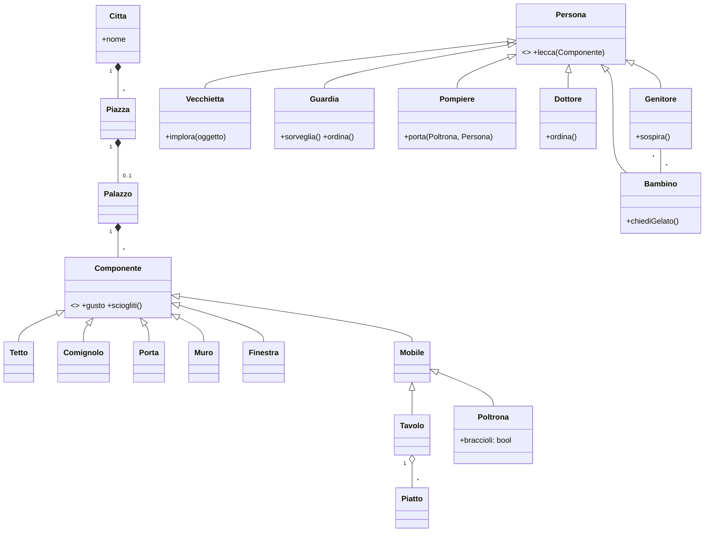
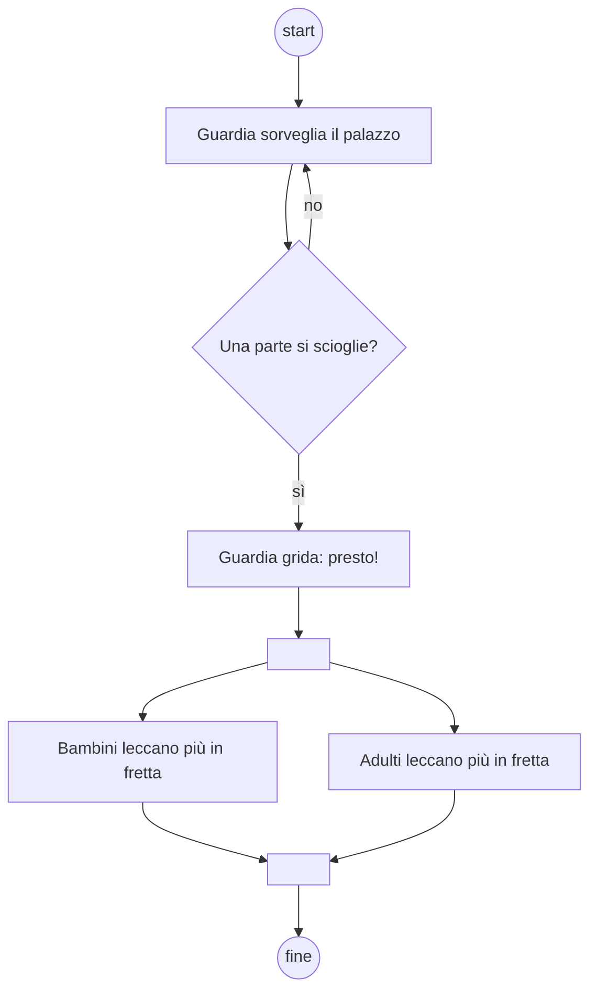

## [mcq 3] L'ereditarietà virtuale in C++
- [ ] È alla base del meccanismo di late binding per la chiamata a funzione.
- [ ] Non esiste.
- [x] Permette di evitare replica di strutture dati in presenza di ereditarietà multipla con classi base condivise.
- [ ] Gestisce la reflection con opportune primitive.

### Soluzione
`class B : virtual public A` risolve il **problema del diamante**: con D che eredita da B e C (entrambe da A), senza `virtual` D conterrebbe due sottooggetti A. Il late binding (a) è dato dalle *funzioni* virtuali, non dall'ereditarietà virtuale.

## [aperta 3] Si scriva un decorator in Python corretto che stampa un messaggio prima della chiamata di una funzione e alla sua terminazione.

### Soluzione
```python
import functools

def traccia(func):
    @functools.wraps(func)          # preserva __name__, __doc__
    def wrapper(*args, **kwargs):
        print(f"Inizio {func.__name__}")
        try:
            return func(*args, **kwargs)
        finally:
            print(f"Fine {func.__name__}")
    return wrapper

@traccia
def somma(a, b):
    return a + b
```
Un decorator è una funzione che prende una funzione e ne restituisce una nuova che la "avvolge". `*args, **kwargs` per accettare qualunque firma; restituire il valore di ritorno; `functools.wraps` (nota: è `functools`, non `functool`).

### Griglia
- 1 | Struttura funzione esterna + wrapper interno restituito
- 1 | Stampa prima e dopo, chiamata con *args/**kwargs e valore restituito
- 1 | Uso corretto della sintassi @decorator (bonus: functools.wraps)

## [aperta 3] Il seguente frammento di codice in C++ e in Java ha un comportamento sostanzialmente differente, discutere quale (si ignorino le piccole differenze sintattiche):

```
class A {
    int x;
    class B {
        int y;
    }
}
```

### Soluzione
- **Java**: `B` è una **inner class** (non statica): ogni istanza di B contiene un riferimento implicito all'istanza di A che l'ha creata (`A.this`) e può accedere direttamente a `x`. Si crea con `a.new B()`.
- **C++**: `B` è solo una **nested class**: A fa da namespace (equivale a una `static class` Java). Non c'è legame con un'istanza di A, quindi B non può accedere a `x` se non le viene passato esplicitamente un oggetto `A`. (Da C++11 una classe annidata ha comunque i diritti d'accesso ai membri privati di A, ma serve sempre un oggetto.)

### Griglia
- 1 | Java: inner class con riferimento implicito all'istanza esterna
- 1 | C++: classe annidata senza istanza esterna (come static nested Java)
- 1 | Conseguenza: accesso a x possibile in Java, non in C++ senza oggetto A

## [mcq 3] In UML uno use case
- [ ] Struttura l'interfaccia grafica del sistema
- [x] Definisce una funzionalità atomica necessaria per l'utente finale
- [ ] Organizza i casi di test del sistema
- [ ] Struttura i pacchetti di classi da fornire al cliente

### Soluzione
Use case = funzionalità che fornisce un risultato di valore a un attore.

## [mcq 3] Le metaclassi in Java
- [x] Non esistono
- [ ] Sono alla base del polimorfismo parametrico
- [ ] Servono nella dependency injection
- [ ] Permettono l'overloading

### Soluzione
Java ha la reflection (`Class<?>`) ma non metaclassi programmabili come Python (`type`) o Smalltalk. Il polimorfismo parametrico in Java sono i generics.

## [aperta 3] Si descriva il design pattern clone (Prototype) e si dettagli la sua struttura in un linguaggio di programmazione a scelta.

### Soluzione
**Prototype** (GoF, creazionale): si creano nuovi oggetti **copiando un'istanza prototipo** invece di istanziarli da zero. Utile se la creazione è costosa o se il tipo concreto è noto solo a runtime. Struttura: interfaccia `Prototype` con `clone()`; ogni `ConcretePrototype` implementa `clone()`; il `Client` chiede al prototipo di clonarsi. Punto critico: **copia superficiale vs profonda**.

```python
import copy

class Forma:
    def __init__(self, colore, punti):
        self.colore, self.punti = colore, punti
    def clone(self):
        return copy.deepcopy(self)

base = Forma("rosso", [(0, 0), (1, 1)])
c = base.clone()
c.punti.append((2, 2))   # non tocca base.punti grazie a deepcopy
```
In Java: `implements Cloneable` e override di `clone()` (che di default fa copia superficiale); in C++: metodo virtuale `virtual Forma* clone() const { return new Forma(*this); }`.

### Griglia
- 1 | Intento: creare oggetti copiando un prototipo
- 1 | Struttura (interfaccia clone, prototipi concreti, client)
- 1 | Codice corretto + distinzione shallow/deep copy

## Contesto
Per le domande seguenti si consideri la storia (Rodari):

> Una volta, a Bologna, fecero un palazzo di gelato proprio sulla Piazza Maggiore, e i bambini venivano di lontano a dargli una leccatina. Il tetto era di panna montata, il fumo dei comignoli di zucchero filato, i comignoli di frutta candita. Tutto il resto era di gelato: le porte di gelato, i muri di gelato, i mobili di gelato. Un bambino piccolissimo si era attaccato a un tavolo e gli leccò le zampe una per una, fin che il tavolo gli crollò addosso con tutti i piatti, e i piatti erano di gelato al cioccolato, il più buono. Una guardia del Comune, a un certo punto, si accorse che una finestra si scioglieva. I vetri erano di gelato alla fragola, e si squagliavano in rivoletti rosa. - Presto, - gridò la guardia, - più presto ancora! E giù tutti a leccare più presto, per non lasciar andare perduta una sola goccia di quel capolavoro. - Una poltrona! - implorava una vecchiettina, che non riusciva a farsi largo tra la folla, - una poltrona per una povera vecchia. Chi me la porta? Coi braccioli, se è possibile. Un generoso pompiere corse a prenderle una poltrona di gelato alla crema e pistacchio, e la povera vecchietta, tutta beata, cominciò a leccarla proprio dai braccioli. Fu un gran giorno, quello, e per ordine dei dottori nessuno ebbe il mal di pancia. Ancora adesso, quando i bambini chiedono un altro gelato, i genitori sospirano: - Eh già, per te ce ne vorrebbe un palazzo intero, come quello di Bologna.

## [aperta 3] Si generi il diagramma a classi della storia nel suo complesso estraendo oggetti.

### Soluzione

Idea centrale: **composizione** Palazzo → componenti di gelato con superclasse comune (che ha `gusto` e `sciogliti()`), gerarchia Persona per i personaggi.

### Griglia
- 1 | Composizione Palazzo/parti (tetto, muri, porte, mobili...)
- 1 | Gerarchie: componenti di gelato e persone/personaggi
- 1 | Associazioni e molteplicità sensate

## [aperta 3] Si estraggano i metodi.

### Soluzione
- `Componente.sciogliti()`, `Componente.crolla()` (tavolo)
- `Persona.lecca(c: Componente)`
- `Guardia.accorgersi(f: Finestra)`, `Guardia.grida(msg)`
- `Vecchietta.implora(oggetto)`
- `Pompiere.portaPoltrona(p: Poltrona, a: Persona)`
- `Dottore.ordina(prescrizione)` (nessuno ha mal di pancia)
- `Bambino.chiediGelato()`, `Genitore.sospira()`

### Griglia
- 1 | Metodi presi dai verbi della storia
- 1 | Assegnati alle classi corrette
- 1 | Firme con parametri sensati

## [aperta 3] Si determinino almeno due storie atomiche estratte dalla storia.

### Soluzione
1. **Come** vecchietta **voglio** chiedere una poltrona con braccioli **così da** potermi sedere tra la folla. *Accettazione*: un pompiere consegna una poltrona alla vecchietta. Stima: 2 punti.
2. **Come** guardia **voglio** accorgermi che una parte del palazzo si scioglie **così da** far intervenire i cittadini. *Accettazione*: quando un componente si scioglie viene emesso l'allarme "Presto!". Stima: 3 punti.
3. **Come** bambino **voglio** leccare il palazzo di gelato **così da** gustarlo.

### Griglia
- 1 | Almeno due storie nel formato ruolo/obiettivo/beneficio
- 1 | Atomiche e indipendenti
- 1 | Criterio di accettazione e/o stima

## [aperta 3] Si presenti un diagramma di attività desumibile da una parte qualunque della storia.

### Soluzione
La finestra che si scioglie:

Alternativa: richiesta poltrona → [anziana] pompiere porta poltrona → vecchietta lecca braccioli. Servono nodo iniziale/finale, decisioni con guardie, fork/join se ci sono azioni parallele.

### Griglia
- 1 | Nodi iniziale/finale e azioni in sequenza
- 1 | Decisione con guardie e/o fork/join
- 1 | Coerenza con la storia
