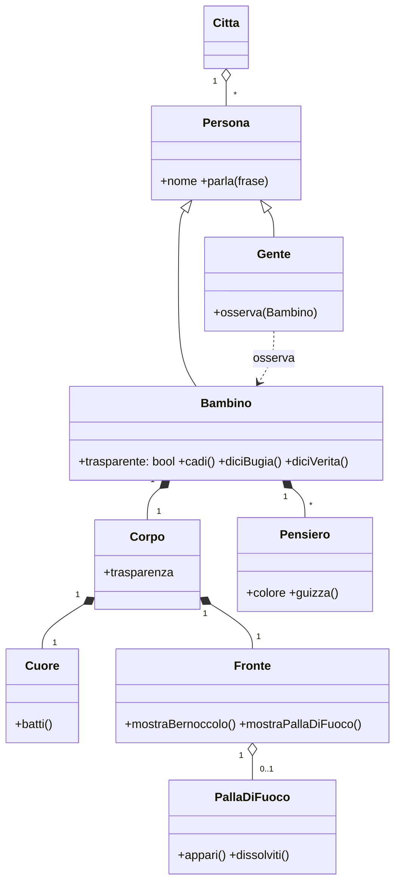
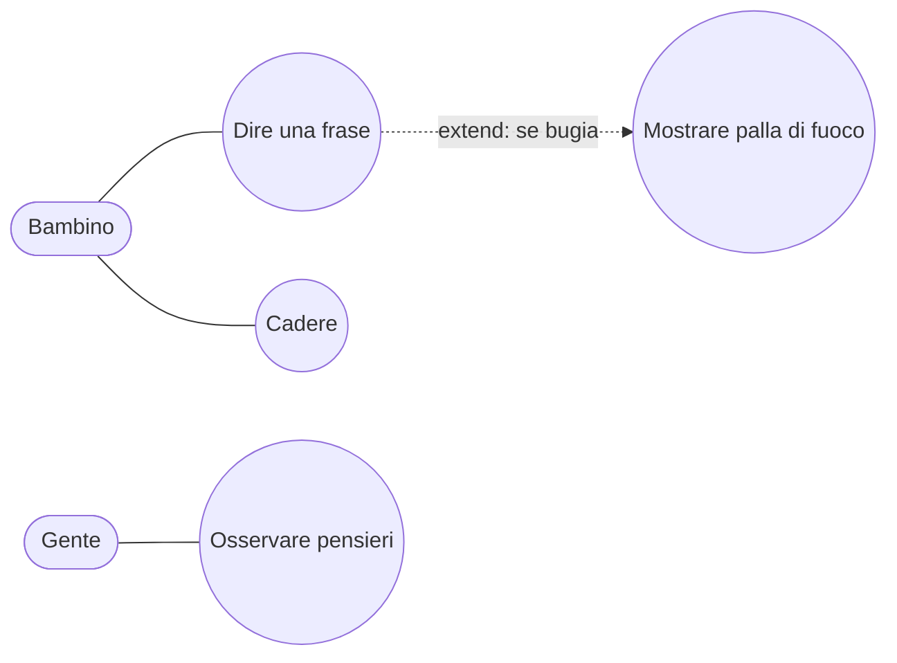
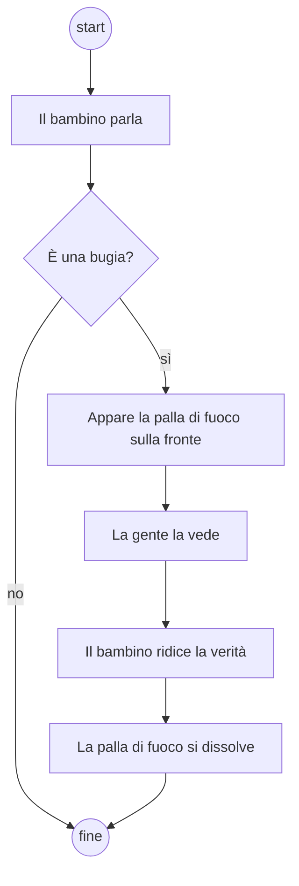

## [mcq 3] UML è l'acronimo per
- [ ] Universal Modeling Language
- [x] Unified Modeling Language
- [ ] Universal Modeling Level
- [ ] Unified Modeling Level

### Soluzione
Unified: nasce dall'unificazione dei metodi di Booch, Rumbaugh (OMT) e Jacobson (OOSE).

## [mcq 3] Un oggetto è
- [ ] Un modello di una classe
- [x] Un'istanza di una classe
- [ ] Una classe
- [ ] Una metaclasse

### Soluzione
La classe è il modello/stampo, l'oggetto ne è un'istanza con identità e stato propri.

## [mcq 3] Un use case
- [ ] È un qualunque requisito
- [ ] È un caso di uso dell'interfaccia utente accettato dall'utente
- [x] È un caso di uso atomico che dà valore all'utente
- [ ] È un requisito semplice del sistema validato dall'utente

### Soluzione
Use case = sequenza di interazioni che porta un risultato di valore a un attore.

## [mcq 3] La relazione extend per un use case
- [x] Definisce un'estensione atomica del mio use case
- [ ] Definisce un use case che è una specializzazione atomica dello use case di partenza
- [ ] Crea con lo use case di partenza un nuovo use case
- [ ] Definisce una relazione di ereditarietà tra use case.

### Soluzione
`<<extend>>`: comportamento opzionale/condizionale che si inserisce in un *extension point* dello use case base. La specializzazione (b, d) è la *generalizzazione* tra use case, cosa diversa.

## [mcq 3] L'ereditarietà virtuale
- [ ] È la tipica forma di ereditarietà che implementa il late binding
- [ ] È una forma di ereditarietà che non permette di istanziare oggetti della classe
- [x] È una forma di ereditarietà che serve ad evitare la moltiplicazione di istanze della classe
- [ ] Non esiste

### Soluzione
In C++ `virtual` nell'ereditarietà evita che, nel diamante, la classe base comune compaia più volte nell'oggetto derivato. (b) descrive le classi astratte.

## Contesto
Si consideri la seguente descrizione (Rodari, "Giacomo di cristallo"):

> "Una volta, in una città lontana, venne al mondo un bambino trasparente. Attraverso le sue membra si poteva vedere come attraverso l'aria e l'acqua. Era di carne e d'ossa e pareva di vetro, e se cadeva non andava in pezzi, ma al più si faceva sulla fronte un bernoccolo trasparente. Si vedeva il suo cuore battere, si vedevano i suoi pensieri guizzare come pesci colorati nella loro vasca. Una volta, per sbaglio, il bambino disse una bugia, e subito la gente poté vedere come una palla di fuoco dietro la sua fronte: ridisse la verità e la palla di fuoco si dissolse. Per tutto il resto della sua vita non disse più bugie."

## [aperta 3] Si generi il diagramma a classi della storia estraendo oggetti, metodi, ecc.

### Soluzione


### Griglia
- 1 | Classi principali (Bambino, Corpo/parti, Pensiero, PallaDiFuoco, Gente)
- 1 | Composizioni/associazioni con molteplicità
- 1 | Metodi e attributi coerenti con la storia

## [aperta 3] Si determinino almeno due use case estratti dalla descrizione.

### Soluzione
Attori: **Bambino**, **Gente**.
- *Dire una frase* (Bambino) — con `<<extend>>` *Mostrare palla di fuoco* se la frase è una bugia.
- *Osservare il bambino* (Gente): vedere cuore e pensieri.
- *Cadere* (Bambino) → mostra bernoccolo trasparente.



### Griglia
- 1 | Attori individuati
- 1 | Almeno due use case sensati, che danno valore all'attore
- 1 | Uso corretto di include/extend o descrizione del flusso

## [aperta 3] Si presenti un diagramma di attività desumibile da una parte qualunque della descrizione.

### Soluzione


### Griglia
- 1 | Nodo iniziale/finale e azioni
- 1 | Decisione con guardie
- 1 | Coerenza con la storia (eventuali swimlane Bambino/Gente)

## [aperta 3] Si descriva il design pattern del singleton e si definisca il codice associato in un linguaggio di programmazione che permetta di implementare le caratteristiche di questo pattern.

### Soluzione
Singleton: una sola istanza + accesso globale. Costruttore privato, istanza statica, metodo statico di accesso con creazione lazy.

```java
public final class Registro {
    private static volatile Registro instance;
    private Registro() { }                     // nessuno può fare new
    public static Registro getInstance() {
        if (instance == null) {
            synchronized (Registro.class) {    // double-checked locking
                if (instance == null) instance = new Registro();
            }
        }
        return instance;
    }
}
```
In C++ moderno: `static Registro& get() { static Registro r; return r; }` (thread-safe da C++11), con costruttore privato e copy constructor `= delete`.

Pro: controllo accesso a risorsa unica. Contro: stato globale, testabilità ridotta, accoppiamento.

### Griglia
- 1 | Intento del pattern
- 1 | Costruttore privato + istanza statica + accessor
- 1 | Codice corretto (bonus thread-safety)

## [aperta 3] Si dettagli la differenza tra overloading e overriding.

### Soluzione
- **Overloading**: più metodi con **stesso nome e firme diverse** (numero/tipo parametri) nella stessa classe (o scope). Risolto **a compile time** (binding statico) in base ai tipi statici degli argomenti. Es. `print(int)`, `print(String)`.
- **Overriding**: una sottoclasse **ridefinisce** un metodo ereditato con **la stessa firma**. Risolto **a runtime** (late binding) in base al tipo dinamico dell'oggetto; è la base del polimorfismo per sottotipo. In C++ richiede `virtual`; in Java è di default (annotazione `@Override`).

```java
class A { void f(int x){} void f(String s){} }   // overloading
class B extends A { @Override void f(int x){} }  // overriding
```

### Griglia
- 1 | Overloading: stesso nome, firme diverse, risolto a compile time
- 1 | Overriding: stessa firma in sottoclasse, risolto a runtime
- 1 | Esempio o collegamento a polimorfismo/virtual
